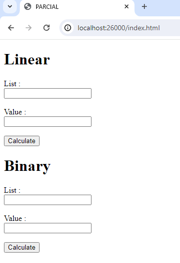
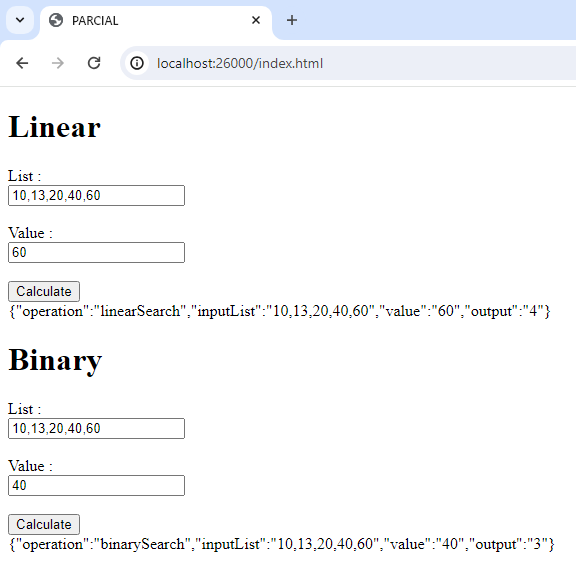
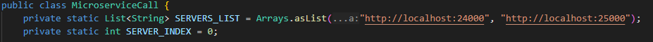
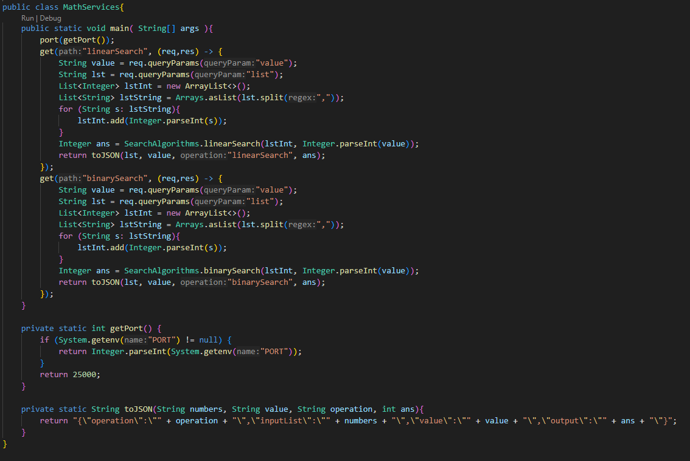
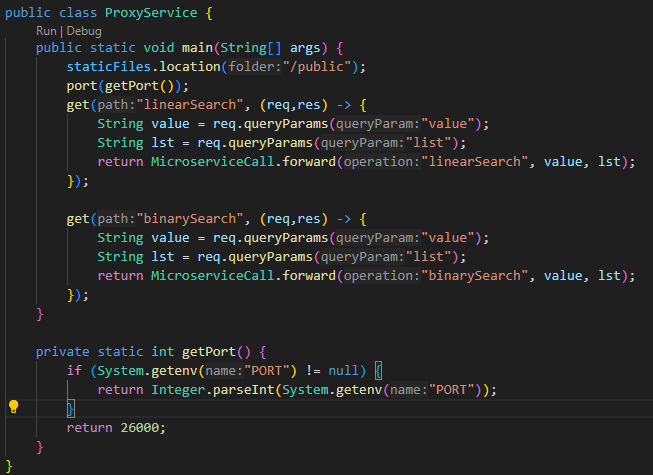
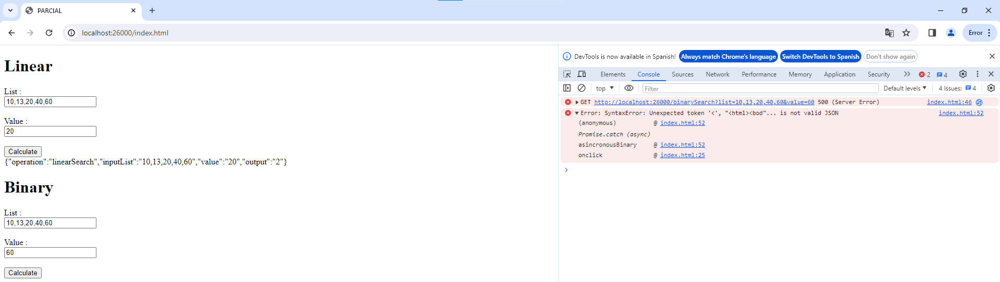
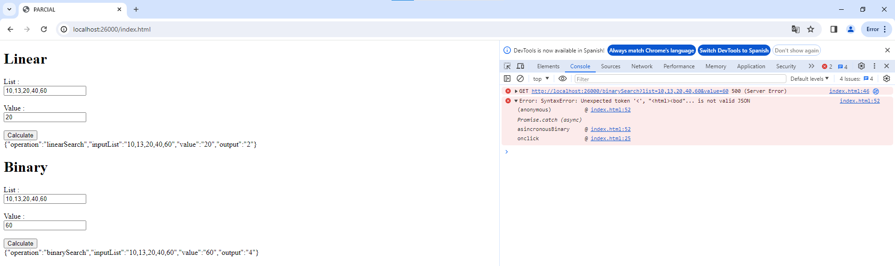

# PARCIAL 2 AREP

Parcial práctico de AREP en el cual se crea un Proxy Server para dos instancias de microservicios las cuales se encargan de buscar elementos en listas por medio de algoritmos de busqueda.

## Diseño
Este proyecto funciona y esta organizado en diferentes componentes con responsabilidades unicas.

1. `MathServices` Componente encargado de recibir las peticiones de ordenamiento de listas, recibe una lista, un valor a buscar y retorna la posición de dicho parametro .
2. `MicroserviceCall` Componente encargado de hacer el llamado a los microservicios de MathServices redirigiendo las peticiones que realiza un usuario. A su vez se encarga de ordenar los llamados por un algoritmo RoundRobin.
3. `ProxyService` Componente encargado de recibir las peticiones de ordenamiento de un front de usuario y redirigirlas mediante el componente Microservicecall.
4. `SearchAlgorithms` Componente que contiene los algoritmos de ordenamiento dadas una lista y un valor a buscar. Implementa linearSearch y binarySearch. 

## Instrucciones de uso

### Pre-requisitos

Antes de ejecutar el servidor es necesario contar con los siguientes programas instalados y funcionando:

1. JDK (Java Development Kit)
2. MVN (Maven)

### Instalación y Ejecución

A continuación se muestra el paso a paso de como instalar y ejecutar el proyecto

1. Clone este repositorio localmente en un entorno o carpeta de trabajo.

```
$ git clone https://github.com/NickArB/AREP-PARCIAL-2.git
```

2. Dentro del entorno o directorio en el que clono el proyecto, asegurese de que no existan ejecutables previos o no deseados con maven.

```
$ mvn clean
```
3. Una vez que los targets han sido descartados compilelos y re asignelos al target.
```
$ mvn package
```
4. Con los target asignados, ejecute el metodo main de la clase HTTPServer. Dependiendo de su IDE esta clase se puede ejecutar de varias formas, en caso de no tener un IDE se recomienda el uso del siguiente comando
```
$ java -cp .\target\AREP-PARCIAL-2-1.0-SNAPSHOT-jar-with-dependencies.jar co.edu.escuelaing.ProxyService
$ java -cp .\target\AREP-PARCIAL-2-1.0-SNAPSHOT-jar-with-dependencies.jar co.edu.escuelaing.MathServices
```
5. Una vez el servicio esta corriendo puede verificar que esta funcionando al escribir la ruta en el navegador
```
http://localhost:26000/
```
A continuación se muestra la interfaz de usuario en el browser donde se puede poner una lista de números y un valor a buscar, es importante que la lista este en orden.



Probando las funcionalidades



Ahora probaremos que el algoritmo de RoundRobin cambiando el codigo para que se consulte a la misma máquina pero en diferentes puertos

- Como se observa se tiene referencia a dos puertos diferentes por los que corren dos instancias de java MathServices



- Ahora se ejecuta una instancia de MathServices que corre por el puerto 25000 dejando de lado la otra



- Ponemos a correr una instancia de ProxyService.java y accedemos a un navegador para poder usar los servicios




- Probamos las dos funcionalidades y podemos observar de que el primer llamado funciona más sin embargo el segundo no ya que no hay ningun servicio corriendo por el puerto 24000. Si se reintenta, ahora si se obtendra respuesta lo que indica y prueba que el algoritmo de RoundRobin si que funciona.





## Construido con

* [Maven](https://maven.apache.org/) - Manejo de dependencias

## Version 1.0

## Autor

* **Nicolás Ariza Barbosa**

<!-- javadoc -d doc -sourcepath src/main/java -subpackages edu.escuelaing.app.taller -->
